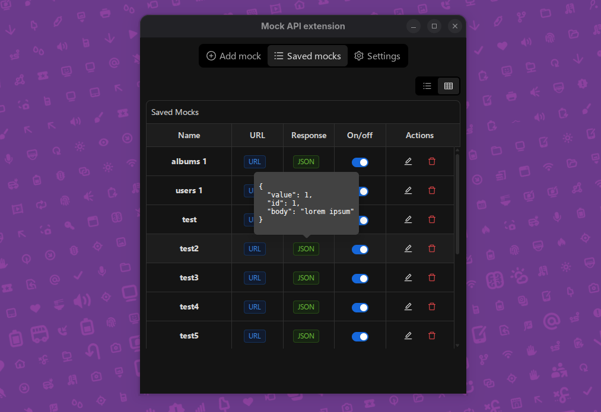
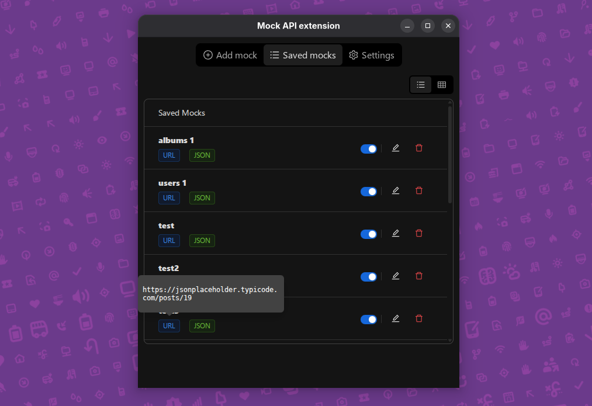

## Chrome mock extension

## Description

Extension for Chromium-based browsers. This extension allows you to mock API requests by substituting real server responses with test data without the need for third-party proxies or complex network tools.

## Main features

- Mock API requests: replace real server responses with test data.
- Work with `chrome.storage.local`: easily manage mock data inside the browser.
- Support for any resources: AJAX (fetch, XMLHttpRequest) and other requests.
- Easy mocks management: add, edit and delete mocks in the extension interface.
- Light and dark theme.

## How it works

1. The user makes a query, e.g. `fetch("https://jsonplaceholder.typicode.com/users")`.
2. The extension checks the list of mocks - if there is a URL match, it intercepts the request.
3. The server response is replaced with the mocked data.

## Technologies

- React + TypeScript
- Ant Design
- Chrome Extensions API
- Vite + yarn

## Who needs it?

1. Frontend-developers - mock APIs without having to bring up a server.
2. QA-engineers - test interfaces with fixed mock data.

## How to install

1. Clone the repository.

```bash
git clone --branch build --single-branch https://github.com/pbarovsky/mock_ext_react.git
```

2. Go to `chrome://extensions/`.
3. Click the "Load unpacked extension" button.
4. Select the `dist` folder from the `mock_ext_react` folder.
5. Start using!

## Images

<p align="center">
  
  <br><strong>Add mock</strong>
</p>

<p align="center">
  
  <br><strong>List of mocks (dark theme)</strong>
</p>

<p align="center">
  
  <br><strong>List of mocks (light theme)</strong>
</p>

<p align="center">
  
  <br><strong>Settings</strong>
</p>

<p align="center">
  
  <br><strong>Example of using the extension. The mocks are turned off.</strong>
</p>

<p align="center">
  
  <br><strong>
An example of how to use the extension. Mocks enabled.</strong>
</p>
